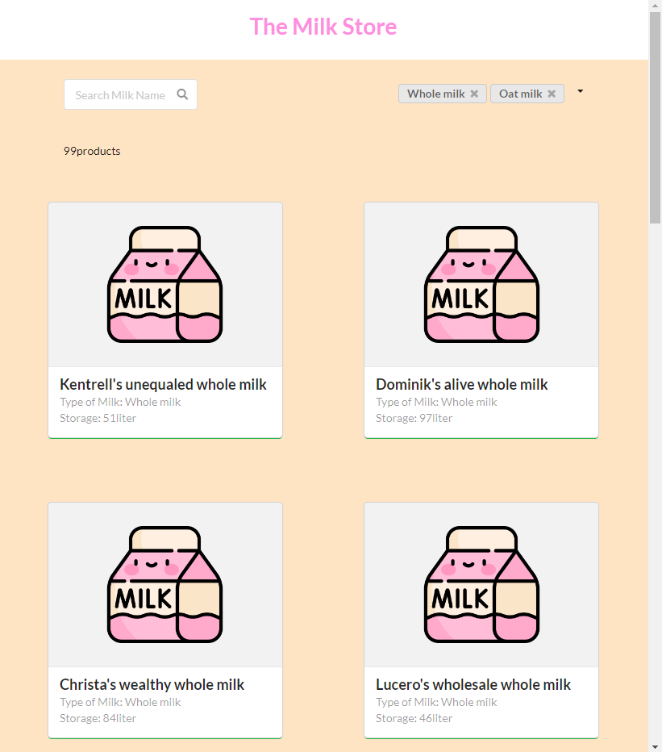

# Milk Products

### Purpose
This project is intended to make a proper website for online milk store business. It connects to its own backend API based on Java and database using PostgreSQL. 

The milk at this store is sold by the liter, and if you thought there was only one type of milk you are waay off! There will be several different types of milk, and you can easily find the type you want.

You can checkout deployment of this project here. https://tiny-blog-neon.vercel.app/

### How to use
This is a [Next.js](https://nextjs.org/) project bootstrapped with [`create-next-app`](https://github.com/vercel/next.js/tree/canary/packages/create-next-app).

```bash
npm install
npm install semantic-ui-react semantic-ui-css

# then
npm run dev

```
Open [http://localhost:3000](http://localhost:3000) with your browser to see the result.

### Details & UI

Details:

On search bar, you can type a name of milks that you need and it will only shows milks that match with the name that you type.
On filter, you can filter out different types of milk; whole milk, oat milk, pea milk, almond milk, rice milk, coconut milk, soy milk, walnut milk, macadamia milk, hemp milk, cashew milk.
You can click on a card and be redirected to the specific milk product page which inclues information of the milk such as name, type, storage. On this page, you can order amount of milk that you want to buy using slider. There is an order button and when you click, confirmation will popup and you can confirm or cancel. 

UI for web version:

<div align=center>
 
</div>

### Tools
This web application is based on NEXT.JS using TypeScript + Sementic UI.

